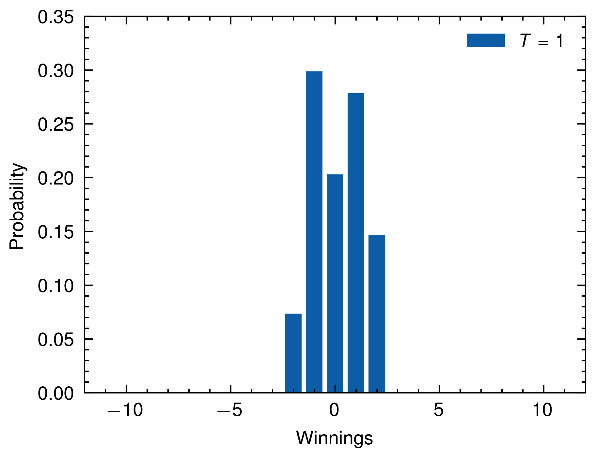
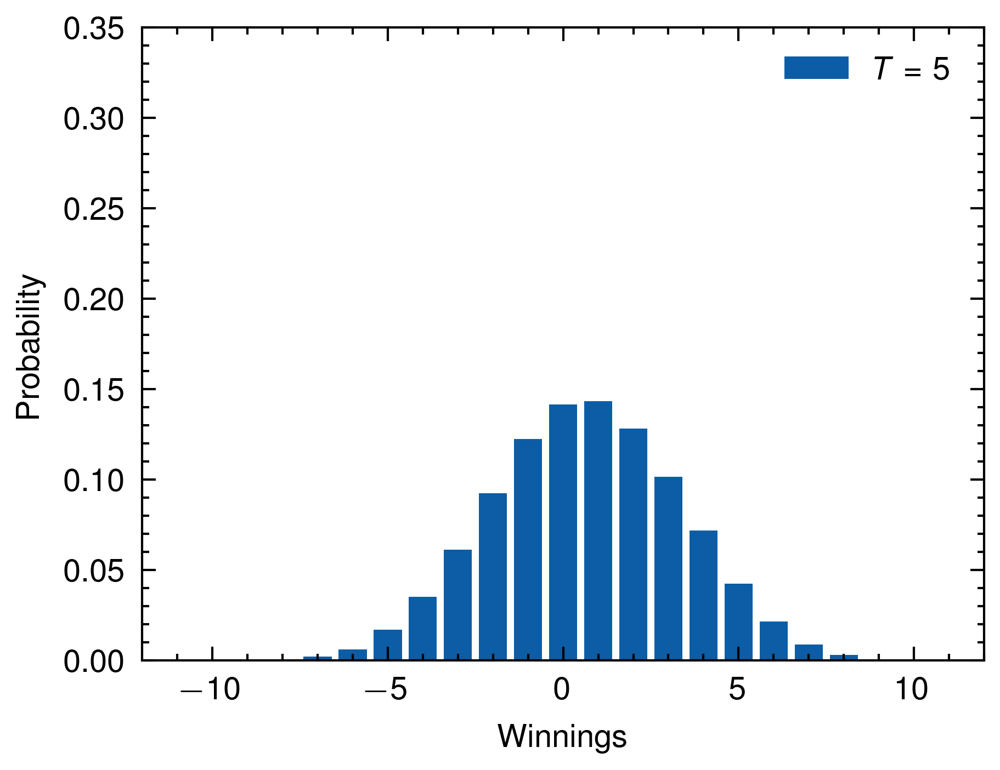
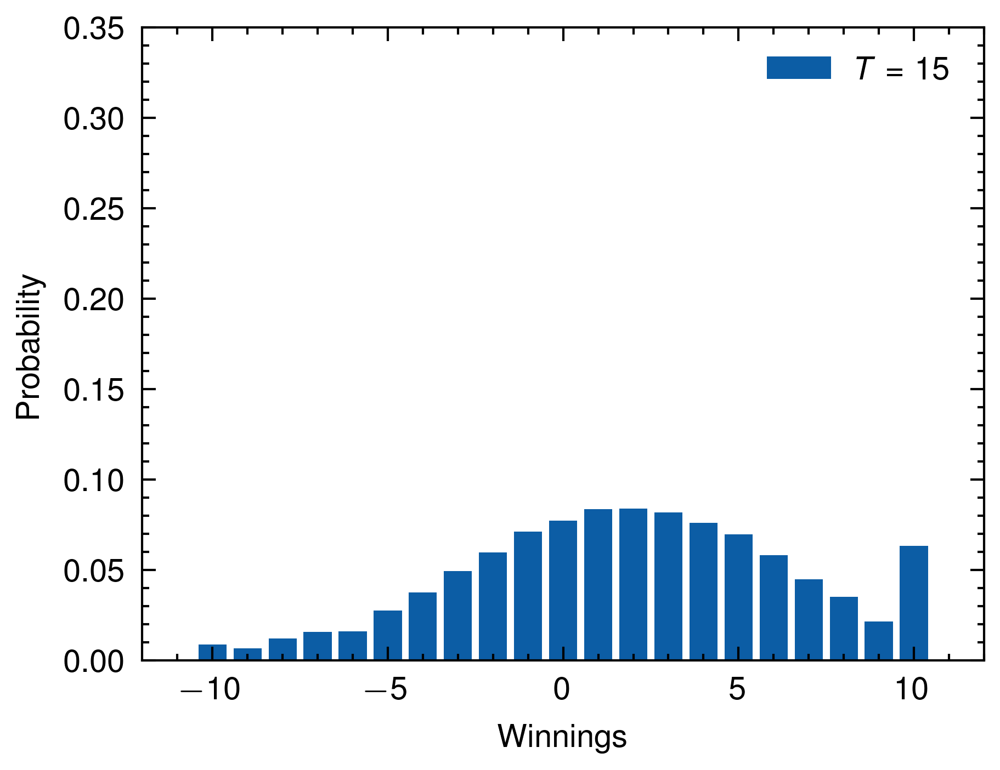
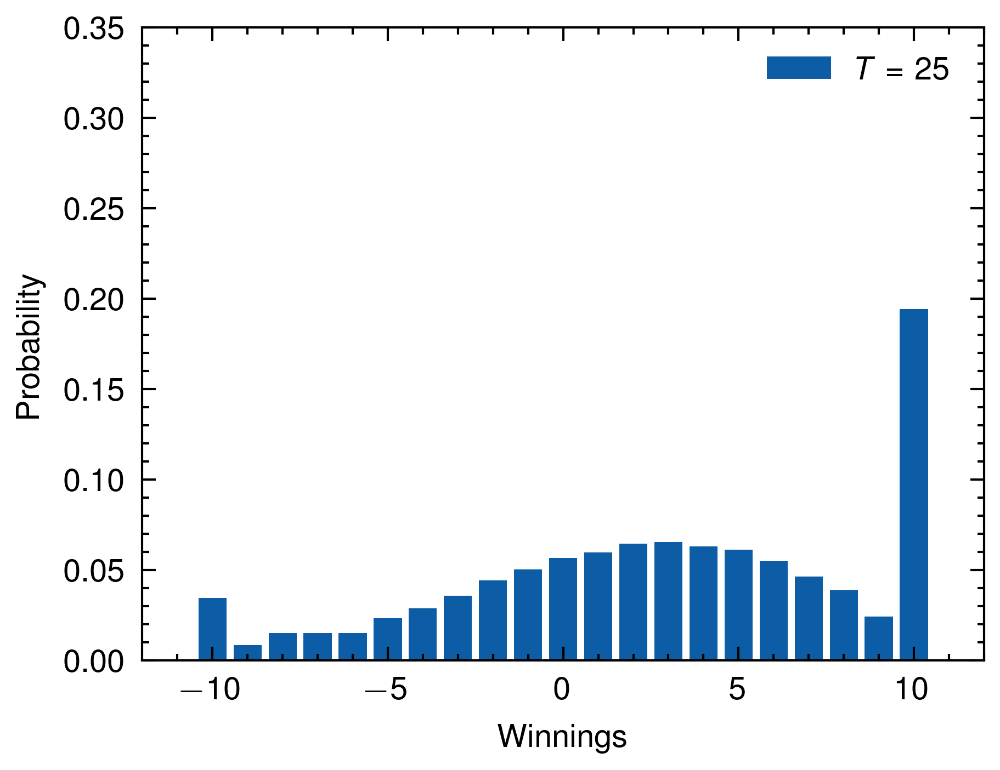
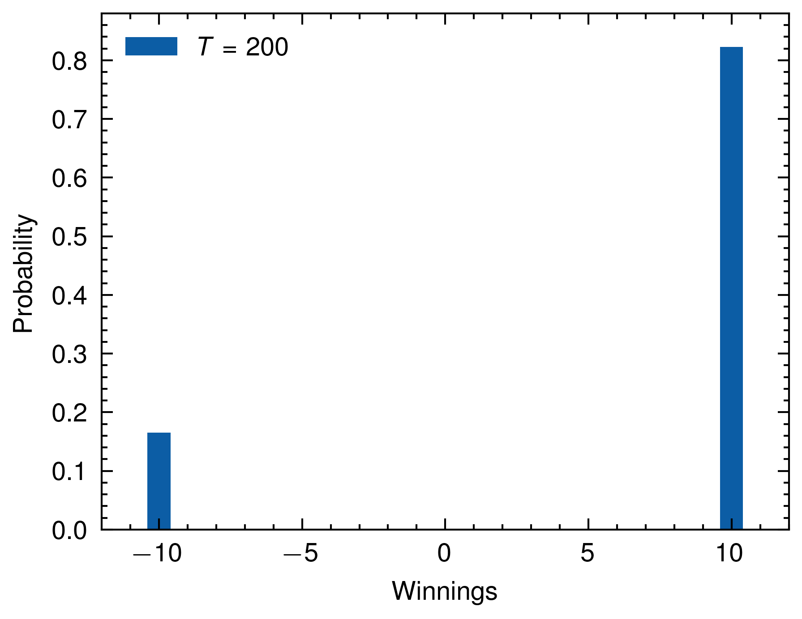

# Rust Kuhn Poker Simulation

This Rust program simulates a Kuhn Poker between two players. The game revolves around card draws and betting, with the ability for players to check, raise, or fold.

## Dependencies

This project uses:

- `peroxide`: A Rust numeric library for scientific computing. Provides functionality for statistical distributions, which are used to simulate the drawing of cards and decision making in the game.
- `std::env::args`: From the Rust standard library, used to handle command line arguments.

## How to Run

This program accepts command line arguments. To run it:

```
cargo run --release -- <rounds>
```

Replace `<rounds>` with the number of rounds you want to simulate.

## How it Works

The simulation is done for `N = 100000` iterations. For each iteration, the game is played for the specified number of rounds or until one player's winnings reach an absolute value of 10.

At the start of each round, both players put a bet into the pot, and each draws a card. Cards are represented as numbers, with a higher number representing a stronger card.

A player may decide to raise the bet based on the strength of their card. The opponent may then decide to either call the raise or fold. If a raise is called, the game goes into checking phase. If the opponent folds, the player who raised wins the pot.

In the checking phase, the player with the stronger card wins the pot. If there is a tie, the pot is split.

## Output

At the end of the simulation, the program prints a DataFrame with the final winnings for each iteration.

The data is also written to a Parquet file named `result.parquet` using the DataFrame's `write_parquet` function. The Parquet file uses uncompressed compression.

The `check` function at the end of the code determines who wins the pot based on the drawn cards.

## Plots

Below are some plots visualizing the results for different numbers of rounds:







---
